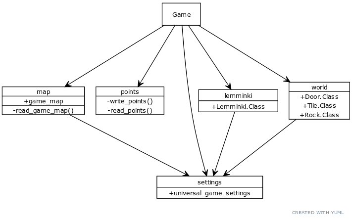
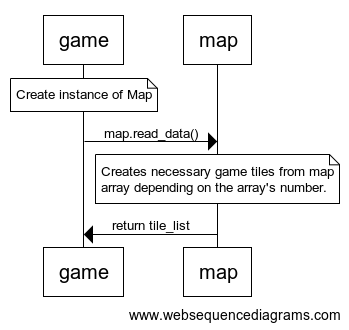

### Arkkitehtuurikuvaus

#### Rakenne
Ohjelman pakkausrakenne on seuraavanlainen:

- Pakkaus 'game' sisältää käyttöliittymän ja pelilogiikan pyörittämisen. Pakkaus vastaa myös törmäyksentunnistuksesta.
- Pakkaus 'lemminki' pitää sisällään pelihahmojen liikkumisesta ja animaatiosta vastaavan koodin.
- Pakkaus map vastaa pelikartan lukemisesta taulukkomuodosta, ja määrittää pelihahmojen ja muide objektien sijainnin.
- Pakkaus points lukee ja kirjoittaa pisteet pistetaulukkoon pistetaulukkoa varten.
- Pakkaus world pitää sisällään koodin, joka vastaa pelimaailmassa olevista objekteista.

#### Toiminnallisuudet
Alustava sekvenssikaaviokuvaus pelikartan luonnista:

