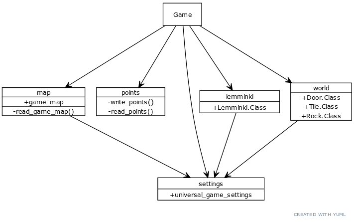
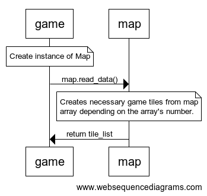

### Arkkitehtuurikuvaus

#### Rakenne
Ohjelman pakkausrakenne on seuraavanlainen:

Pakkaus game sisältää käyttöliittymän ja pelilogiikan pyörityksen, lemminki pitää sisällään pelihahmojen liikkumisesta ja animaatiosta vastaavan koodin, map hallitsee pelikartan luonnin, points lukee ja kirjoittaa pisteet pistetaulukkoon ja world pitää sisällään koodin, joka vastaa pelimaailmassa olevista objekteista. 

#### Toiminnallisuudet
Alustava sekvenssikaaviokuvaus pelikartan luonnista:

