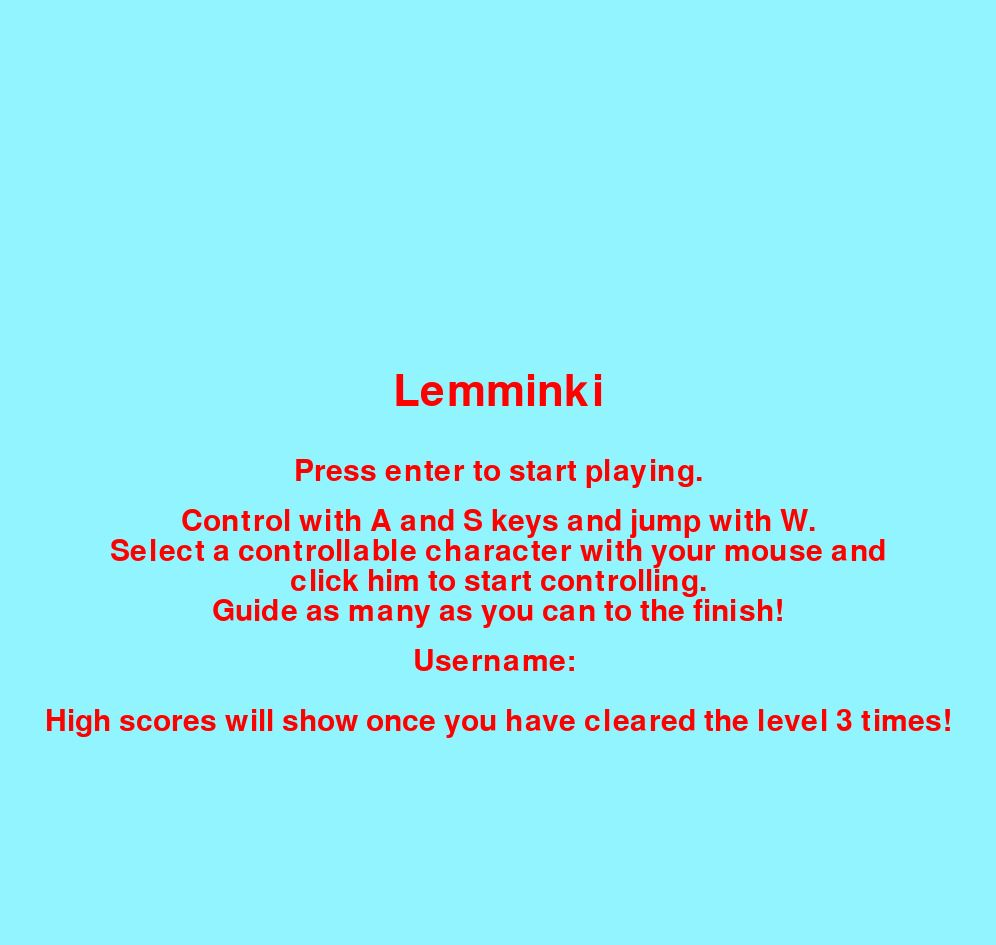

#### Käyttöohje
Lataa projektin viimeisimmän releasen lähdekoodi etusivun sivupalkissa näkyvästä linkistä. 

### Ohjelman käynnistäminen
<<<<<<< HEAD
** Seuraavat komennot tulee suorittaa projektin src-kansiosssa.**
=======
_Seuraavat komennot tulee suorittaa projektin src-kansiosssa._
>>>>>>> 4a05b10266fd09d4a5618b6a8baf852e066bb2ad

Ennen ohjelman käynnistystä tulee asentaa tarvittavat riippuvuudet seuraavalla komennolla:
```bash
poetry install
```
Tämän jälkeen voit käynnistää pelin kirjoittamalla seuraavan komennon:
```bash
poetry run invoke start
```

### Ohjelman toiminta
Peli käynnistyy etusivulle:


Etusivulla voit kirjoittaa käyttäjänimen pelin pistetaulukkoa varten (voit myös pyyhkiä virhelyönnit nimestäsi). Etusivu opastaa pelissä käytetyt näppäin- ja hiirikomennot. 

Kun painat Enteriä, niin peli alkaa ja näkymä muuttuu jotakuinkin seuraavanlaiseksi:
<<<<<<< HEAD

=======

>>>>>>> 4a05b10266fd09d4a5618b6a8baf852e066bb2ad
